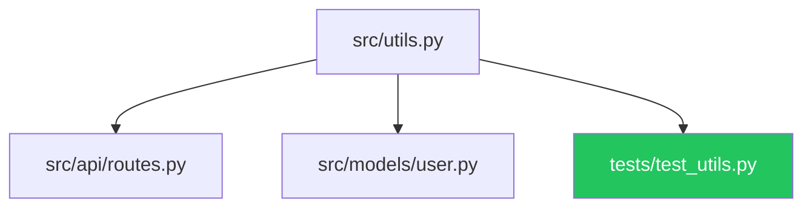

# blast-radius

**What breaks if I change this file?**

`blast-radius` builds an incremental AST call graph for your Python project and
answers the question instantly. It indexes imports and symbol definitions into
SQLite (SHA-256 cached — only changed files are re-indexed) and resolves
transitive dependents in milliseconds.

```bash
pip install blast-radius
```

[](https://pypi.org/project/blast-radius/)
[](https://www.python.org/)
[](LICENSE)
[](https://github.com/brokenbartender/blast-radius/actions)

---

## Quickstart

```bash
# Build the graph (incremental — only re-indexes changed files)
blast-radius --build

# What breaks if I change src/utils.py?
blast-radius --query src/utils.py

# Output a Mermaid diagram (renders in GitHub READMEs / PRs)
blast-radius --query src/utils.py --mermaid

# Watch mode — auto-rebuild on every save
blast-radius --watch

# Raw JSON output (pipe to jq, scripts, CI)
blast-radius --query src/utils.py --json
```

---

## Terminal output (with Rich)

```
src/utils.py  ⚡ GOD NODE
├── 📄 src/api/routes.py
├── 📄 src/models/user.py
├── 🧪 tests/test_utils.py
└── 🧪 tests/test_api.py
  14 file(s) affected · in-degree 47 · 2 test file(s)
```

Install Rich for colored output:

```bash
pip install blast-radius[rich]
```

---

## Mermaid diagram (renders in GitHub)

```python
from blast_radius import build_graph, get_blast_radius, to_mermaid

build_graph()
result = get_blast_radius("src/utils.py")
print(to_mermaid(result))
```

Paste the output into any GitHub issue, PR, or README:



---

## Python API

```python
from blast_radius import build_graph, get_blast_radius, to_mermaid, watch

# Build the import graph (incremental — re-indexes only changed files)
n = build_graph()
print(f"{n} files indexed")

# Query blast radius
result = get_blast_radius("src/mymodule.py")
print(result["total_affected"])   # int
print(result["direct_dependents"])  # list of file paths
print(result["test_files"])         # files that start with tests/

# Mermaid output
diagram = to_mermaid(result)

# Watch mode (blocking — runs until Ctrl+C)
watch(interval=2.0)
```

---

## Configuration

All paths are configurable — no hardcoded assumptions:

```bash
# Scan only specific directories
blast-radius --build --scan src tests

# Use a custom DB path (useful in CI)
blast-radius --build --db /tmp/my-graph.db

# Adjust watch poll interval
blast-radius --watch --interval 1.0
```

Or via Python API:

```python
from pathlib import Path
build_graph(scan_dirs=["src", "tests"], db_path=Path("/tmp/my-graph.db"))
get_blast_radius("src/utils.py", db_path=Path("/tmp/my-graph.db"))
```

---

## GitHub Action — comment blast radius on PRs

```yaml
# .github/workflows/blast-radius.yml
name: Blast Radius
on: [pull_request]

jobs:
  blast-radius:
    runs-on: ubuntu-latest
    permissions:
      pull-requests: write
    steps:
      - uses: actions/checkout@v4
      - uses: actions/setup-python@v5
        with: {python-version: "3.11"}
      - run: pip install blast-radius
      - name: Compute blast radius
        id: br
        run: |
          blast-radius --build
          echo "mermaid<<EOF" >> $GITHUB_OUTPUT
          blast-radius --query "${{ github.event.pull_request.head.sha }}" --mermaid >> $GITHUB_OUTPUT
          echo "EOF" >> $GITHUB_OUTPUT
      - uses: marocchino/sticky-pull-request-comment@v2
        with:
          message: |
            ## Blast Radius

            ${{ steps.br.outputs.mermaid }}
```

---

## Graphify god-node detection (optional)

If you have [`graphify`](https://github.com/graphify-io/graphify) installed and
have run `graphify update .` in your repo, `blast-radius` will enrich results with
transitive centrality data and flag **god nodes** (files imported by 30+ modules):

```python
result = get_blast_radius("src/core.py")
if result.get("graphify", {}).get("god_node"):
    print("WARNING: this is a god node — change it carefully")
```

---

## Installation

```bash
# Core (no dependencies)
pip install blast-radius

# With Rich colored output
pip install blast-radius[rich]

# With watchdog file watching (faster than polling)
pip install blast-radius[watch]

# Everything
pip install blast-radius[all]
```

---

## Part of the LexiPro Sovereign OS

`blast-radius` is extracted from **[LexiPro](https://lexipro.online)** — a local-first
agentic OS where it powers the **pre-edit safety gate**: before any agent touches a
kernel file, `get_blast_radius()` checks if it's a god node. Agents touching files
with in-degree ≥ 30 must acquire a hard mutex first.

---

## License

MIT — see [LICENSE](LICENSE).

Built by [Broken Arrow Entertainment LLC](https://lexipro.online) · Sovereign Intelligence Systems Group
