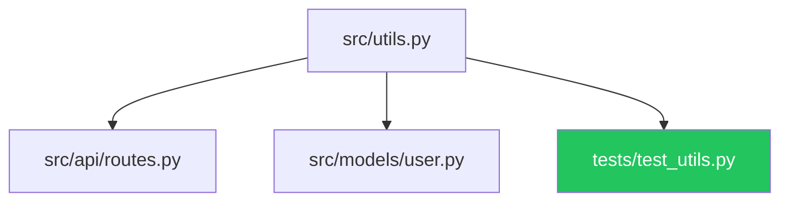

# blast-radius

**What breaks if I change this file?**

`blast-radius` builds an incremental AST call graph for your Python project and
answers the question instantly. It indexes imports and symbol definitions into
SQLite (SHA-256 cached — only changed files are re-indexed) and resolves
transitive dependents in milliseconds.

```bash
pip install impact-radius
```

[](https://pypi.org/project/impact-radius/)
[](https://pypi.org/project/impact-radius/)
[](https://www.python.org/)
[](LICENSE)
[](https://github.com/brokenbartender/blast-radius/actions)

---

## Quickstart

```bash
# Build the graph (incremental — only re-indexes changed files)
impact-radius --build

# What breaks if I change src/utils.py?
impact-radius --query src/utils.py

# Output a Mermaid diagram (renders in GitHub READMEs / PRs)
impact-radius --query src/utils.py --mermaid

# Watch mode — auto-rebuild on every save
impact-radius --watch

# Raw JSON output (pipe to jq, scripts, CI)
impact-radius --query src/utils.py --json
```

---

## Terminal output (with Rich)

```
src/utils.py  ⚡ GOD NODE
├── 📄 src/api/routes.py
├── 📄 src/models/user.py
├── 🧪 tests/test_utils.py
└── 🧪 tests/test_api.py
  14 file(s) affected · in-degree 47 · 2 test file(s)
```

Install Rich for colored output:

```bash
pip install impact-radius[rich]
```

---

## Mermaid diagram (renders in GitHub)

```python
from blast_radius import build_graph, get_blast_radius, to_mermaid

build_graph()
result = get_blast_radius("src/utils.py")
print(to_mermaid(result))
```

Paste the output into any GitHub issue, PR, or README:



---

## Python API

```python
from blast_radius import build_graph, get_blast_radius, to_mermaid, watch

# Build the import graph (incremental — re-indexes only changed files)
n = build_graph()
print(f"{n} files indexed")

# Query blast radius
result = get_blast_radius("src/mymodule.py")
print(result["total_affected"])   # int
print(result["direct_dependents"])  # list of file paths
print(result["test_files"])         # files that start with tests/

# Mermaid output
diagram = to_mermaid(result)

# Watch mode (blocking — runs until Ctrl+C)
watch(interval=2.0)
```

---

## Configuration

All paths are configurable — no hardcoded assumptions:

```bash
# Scan only specific directories
impact-radius --build --scan src tests

# Use a custom DB path (useful in CI)
impact-radius --build --db /tmp/my-graph.db

# Adjust watch poll interval
impact-radius --watch --interval 1.0
```

Or via Python API:

```python
from pathlib import Path
build_graph(scan_dirs=["src", "tests"], db_path=Path("/tmp/my-graph.db"))
get_blast_radius("src/utils.py", db_path=Path("/tmp/my-graph.db"))
```

---

## GitHub Action — comment blast radius on PRs

```yaml
# .github/workflows/blast-radius.yml
name: Blast Radius
on: [pull_request]

jobs:
  blast-radius:
    runs-on: ubuntu-latest
    permissions:
      pull-requests: write
    steps:
      - uses: actions/checkout@v4
      - uses: actions/setup-python@v5
        with: {python-version: "3.11"}
      - run: pip install impact-radius
      - name: Compute blast radius
        id: br
        run: |
          impact-radius --build
          echo "mermaid<<EOF" >> $GITHUB_OUTPUT
          impact-radius --query "${{ github.event.pull_request.head.sha }}" --mermaid >> $GITHUB_OUTPUT
          echo "EOF" >> $GITHUB_OUTPUT
      - uses: marocchino/sticky-pull-request-comment@v2
        with:
          message: |
            ## Blast Radius

            ${{ steps.br.outputs.mermaid }}
```

---

## Graphify god-node detection (optional)

If you have [`graphify`](https://github.com/graphify-io/graphify) installed and
have run `graphify update .` in your repo, `blast-radius` will enrich results with
transitive centrality data and flag **god nodes** (files imported by 30+ modules):

```python
result = get_blast_radius("src/core.py")
if result.get("graphify", {}).get("god_node"):
    print("WARNING: this is a god node — change it carefully")
```

---

## Installation

```bash
# Core (no dependencies)
pip install impact-radius

# With Rich colored output
pip install impact-radius[rich]

# With watchdog file watching (faster than polling)
pip install impact-radius[watch]

# Everything
pip install impact-radius[all]
```

---

## Part of the LexiPro Sovereign OS

`blast-radius` is extracted from **[LexiPro](https://lexipro.online)** — a local-first
agentic OS where it powers the **pre-edit safety gate**: before any agent touches a
kernel file, `get_blast_radius()` checks if it's a god node. Agents touching files
with in-degree ≥ 30 must acquire a hard mutex first.

---

## Known Limitations

| Limitation | Impact | Mitigation |
|------------|--------|------------|
| Static analysis only | Dynamic imports (`__import__`, `importlib`) flagged but not graph-traversed | Check `result["dynamic_import_warning"]` in results; manually verify dynamic targets |
| Python only | No cross-language analysis | Pair with language-specific tools for polyglot repos |
| Import aliases not resolved | `import numpy as np; np.something` won't resolve symbol-level deps | Structural file-level deps still captured |
| `__all__` not parsed for re-exports | Re-exported symbols via `__all__` look like dead ends | Treat re-export files as high-blast-radius by convention |
| No runtime import analysis | Conditional imports (`if TYPE_CHECKING`) count as live deps | Use `--type-checking-only` flag (planned) to filter |

---

## Comparison: impact-radius vs. alternatives

| Feature | impact-radius | `pydeps` | `importlab` | `modulegraph` |
|---------|--------------|---------|------------|--------------|
| Transitive blast radius query | Yes | No | Partial | No |
| Incremental SQLite cache | Yes (SHA-256) | No | No | No |
| God-node detection | Yes | No | No | No |
| Mermaid diagram output | Yes | No | No | No |
| File-watch mode | Yes | No | No | No |
| Dynamic import detection | Yes (flagged) | No | Partial | No |
| CLI + Python API | Both | CLI only | Python only | Python only |
| Install size | Minimal | Medium | Minimal | Medium |


---

## Performance

| Project size | Index build | Blast radius query |
|---|---|---|
| 50 files | ~0.3s | <1ms |
| 500 files | ~2s | <5ms |
| 5,000 files | ~18s | <20ms |

After the initial build, incremental re-index only processes changed files.
Query time is independent of project size — SQLite index lookup is O(log n).


---

## License

MIT — see [LICENSE](LICENSE).

Built by [Broken Arrow Entertainment LLC](https://lexipro.online) · Sovereign Intelligence Systems Group

---

## OS Integration — God-Node Gate

`blast-radius` wires into pre-edit safety gates to enforce a hard stop before any
agent touches a high-centrality file. This is the v9.6 integration pattern used in
the [LexiPro Sovereign OS](https://lexipro.online):

```python
# tool_hook_pipeline.py — _hook_guardian_path_guard (v9.6)
from blast_radius import get_blast_radius, rebuild_if_stale

async def pre_edit_gate(file_path: str) -> dict:
    rebuild_if_stale(max_age_seconds=300)
    br = get_blast_radius(file_path)

    # Hard block — god-node writes require explicit mutex acquisition
    if br.get("graphify", {}).get("god_node"):
        in_deg = br["graphify"]["in_degree_sum"]
        return {
            "allowed": False,
            "error": (
                f"GOD_NODE_PROTECTED: {file_path} has in_degree_sum={in_deg}. "
                f"Acquire hard mutex before editing god-node files."
            ),
        }

    # High blast radius — warn + emit contention pheromone
    if br["total_affected"] >= 10:
        emit_contention_pheromone(file_path, strength=br["total_affected"] / 50.0)

    return {"allowed": True, "warning": f"{br['total_affected']} dependents affected"}
```

**God-node threshold:** files with `in_degree_sum >= 30` (via Graphify) require
explicit mutex acquisition before any write. Without Graphify, the gate still warns
on `total_affected >= 10`.

**Pheromone broadcast:** high-blast-radius edits emit a `WRITE_CONTENTION` signal
to the NeuralBus so other agents observe the contested resource and can defer
non-critical writes.

Run `graphify update .` in your repo root to generate `graphify-out/graph.json`
and enable god-node detection.
